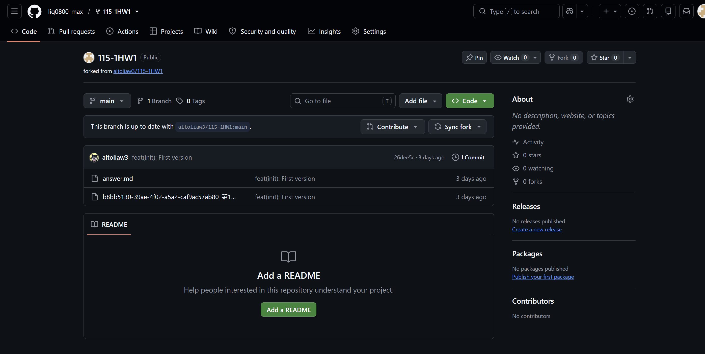
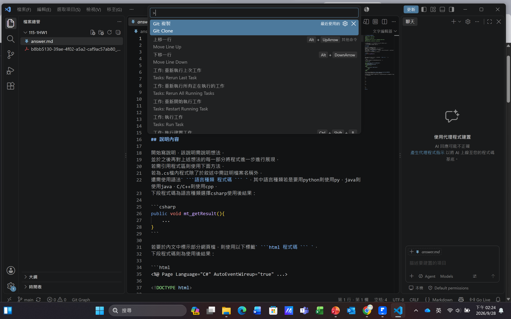
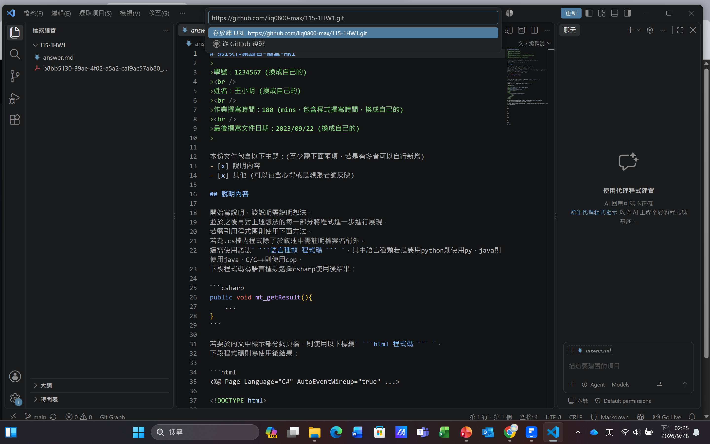
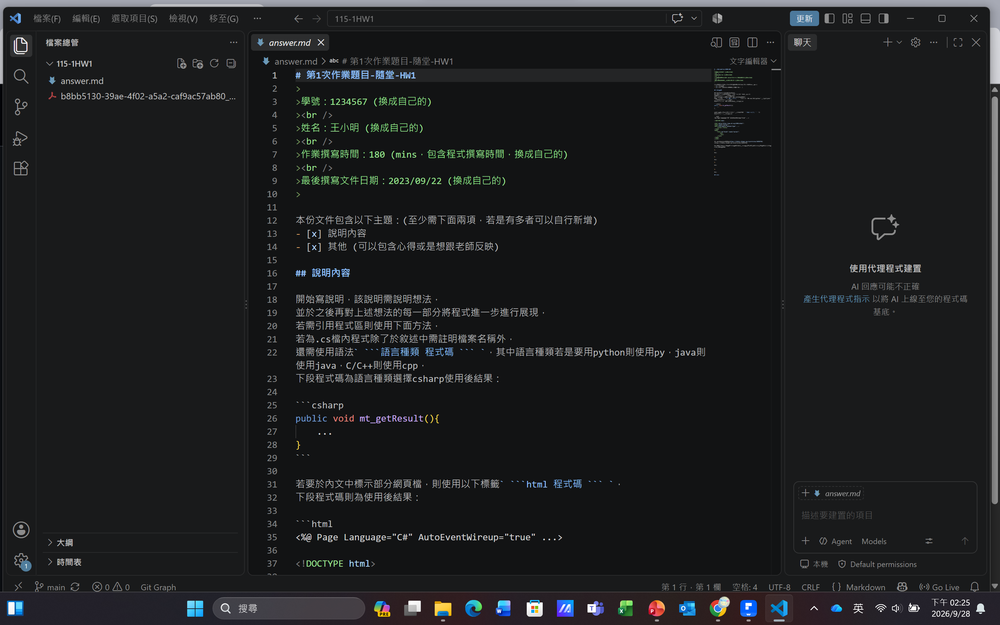

# 第1次作業題目-隨堂-HW1
>
>學號：113111123 (換成自己的)
><br />
>姓名：李毓倩 (換成自己的)
><br />
>作業撰寫時間：120 (mins，包含程式撰寫時間，換成自己的)
><br />
>最後撰寫文件日期：2026/09/28(換成自己的)
>

本份文件包含以下主題：(至少需下面兩項，若是有多者可以自行新增)
- [x] 說明內容
- [x] 其他 (可以包含心得或是想跟老師反映)

## 說明內容

開始寫說明，該說明需說明想法，
並於之後再對上述想法的每一部分將程式進一步進行展現，
若需引用程式區則使用下面方法，
若為.cs檔內程式除了於敘述中需註明檔案名稱外，
還需使用語法` ```語言種類 程式碼 ``` `，其中語言種類若是要用python則使用py，java則使用java，C/C++則使用cpp，
下段程式碼為語言種類選擇csharp使用後結果：

```csharp
public void mt_getResult(){
    ...
}
```

若要於內文中標示部分網頁檔，則使用以下標籤` ```html 程式碼 ``` `，
下段程式碼則為使用後結果：

```html
<%@ Page Language="C#" AutoEventWireup="true" ...>

<!DOCTYPE html>

<html xmlns="http://www.w3.org/1999/xhtml">
<head runat="server">
<meta http-equiv="Content-Type" ...>
    <title></title>
</head>
<body>
    <form id="form1" runat="server">
        <div>
        </div>
    </form>
</body>
</html>
```
更多markdown方法可參閱[https://ithelp.ithome.com.tw/articles/10203758](https://ithelp.ithome.com.tw/articles/10203758)

請在撰寫"說明程式與內容"該塊內容，請把原該塊內上述敘述刪除，該塊上述內容只是用來指引該怎麼撰寫內容。

1. 

Ans:先開啟老師的連結後登入自己的git hub帳號，右上角點 Fork 按鈕。
確認 Owner 是自己的帳號，按 Create fork。然後終端機上打上git clone，貼上剛剛github複製的檔案連結打開






2. 

Ans:
標題 # 大標題  ## 中標題  ### 小標題
粗體  **粗體**
斜體	*斜體*
無序清單	- 項目
有序清單	1. 項目	1. 項目
連結	[文字](網址)	可點的連結
圖片		顯示圖片
程式碼	用單個反引號包住程式碼	等寬字體
引用	> 引用的話	縮排的引用
分隔線	---	一條橫線
列表 * Item 1
* Item 2
  * Item 2a
  * Item 2b
CheckBox
- [x] This is a complete item
- [ ] This is an incomplete item

範例是
# 小熊早午餐 菜單

## 一、招牌推薦

**招牌鬆餅**,外酥內軟,就像*口感像雲朵一樣蓬鬆*。

### 使用說明

點餐時請告訴店員代碼,例如 `A01`、`B02`。

---

## 二、餐點分類

- 主餐
  - 鬆餅
  - 蛋餅
- 飲品
  - 紅茶
  - 咖啡
- 甜點

## 三、點餐步驟

1. 看菜單
2. 選餐點
3. 到櫃台結帳

## 四、今日供應狀況

- [x] 招牌鬆餅(供應中)
- [ ] 草莓蛋糕(已售完)

## 五、店家提醒

> 餐點含堅果,有過敏者請先告知店員。

更多資訊:[小熊早午餐官網](https://example.com)


3. 

Ans:


4. 

Ans:

## 其他